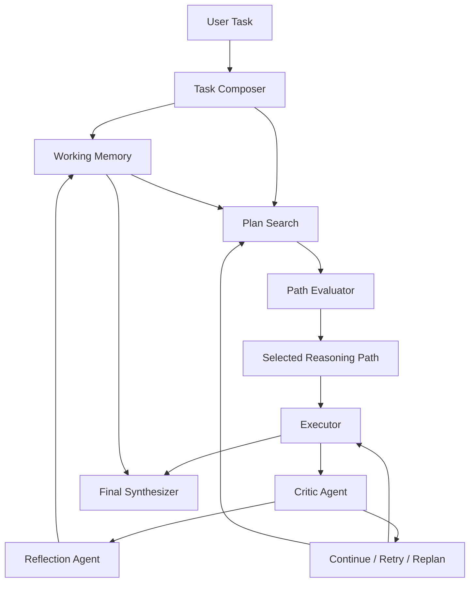

# Reflective Plan-and-Execute Agent

A Python prototype for a reflective plan-and-execute agent architecture. The
current version focuses on clear task planning, structured run state, traceable
step execution, lightweight replanning, and final answer synthesis.

## Current Features

- Generates a structured execution plan for a user task.
- Composes raw user input into a structured task profile.
- Extracts the goal, task type, constraints, success criteria, and assumptions.
- Stores each run in an explicit `AgentState`.
- Tracks the task, plan, execution results, replan count, and trace events.
- Executes each plan step with access to prior step history.
- Uses a critic agent to score execution quality, goal alignment, and evidence strength.
- Uses a reflection agent to turn critiques into lessons, failure modes, and correction strategies.
- Maintains explicit working memory for observations, decisions, failed attempts, and lessons.
- Feeds working memory back into planning, execution, replanning, and synthesis.
- Generates multiple candidate reasoning paths before execution.
- Scores candidate paths by goal alignment, feasibility, evidence potential, and risk.
- Selects the highest-scoring path as the executable plan.
- Supports retrying a weak step or replanning remaining work based on critic feedback.
- Replans only the remaining work when execution diverges from expectations.
- Synthesizes all step results into a final structured answer.

## Roadmap

1. Clean baseline implementation. Done.
2. Structured agent state and execution trace. Done.
3. Task composition with goals, constraints, and success criteria. Done.
4. Critic and reflexion loop for self-correction. Done.
5. Working memory for multi-step reasoning. Done.
6. Search-based reasoning over multiple candidate plans. Done.
7. Product demo with traceable reasoning output. Done.

## Setup

```powershell
python -m venv .venv
.\.venv\Scripts\Activate.ps1
pip install -r requirements.txt
```

Set your OpenAI API key:

```powershell
$env:OPENAI_API_KEY="your-api-key"
```

Run the demo:

```powershell
python demo.py
```

Run with a custom task and save the full trace:

```powershell
python demo.py --task "Compare LangGraph, CrewAI, and AutoGen for an internal knowledge-base agent." --trace-out runs/trace.json
```

Run tests:

```powershell
python -m unittest discover -s tests
```

Analyze a saved trace:

```powershell
python analyze_trace.py runs/trace.json
```

Print the trace analysis as JSON:

```powershell
python analyze_trace.py runs/trace.json --json
```

## Architecture Direction

This project is intended to evolve into a reflective planning and reasoning
agent. The target architecture includes task composition, explicit working
memory, critic-agent feedback, reflection-agent self-correction, and
search-based reasoning over multiple candidate solution paths.

## Architecture



## Demo Output

The CLI demo prints:

- The composed task type and goal.
- Candidate reasoning paths with scores.
- The selected path.
- Step-level execution quality.
- Working-memory counts.
- The final answer.

Use `--trace-out` to save the full `AgentState` as JSON for inspection.

## Trace Analyzer

`analyze_trace.py` converts a saved run trace into a compact reasoning report:

- Selected reasoning path and candidate path scores.
- Executed step count, retry count, and replan count.
- Average critic scores for quality, goal alignment, and evidence strength.
- Critic issues, reflection lessons, and working-memory counts.
- Whether a final answer was produced.

## Project Positioning

Reflective Plan-and-Execute Agent is an LLM agent prototype for complex task
solving. It combines task composition, explicit working memory, multi-path plan
search, critic-agent evaluation, reflection-agent self-correction, and traceable
execution state.
