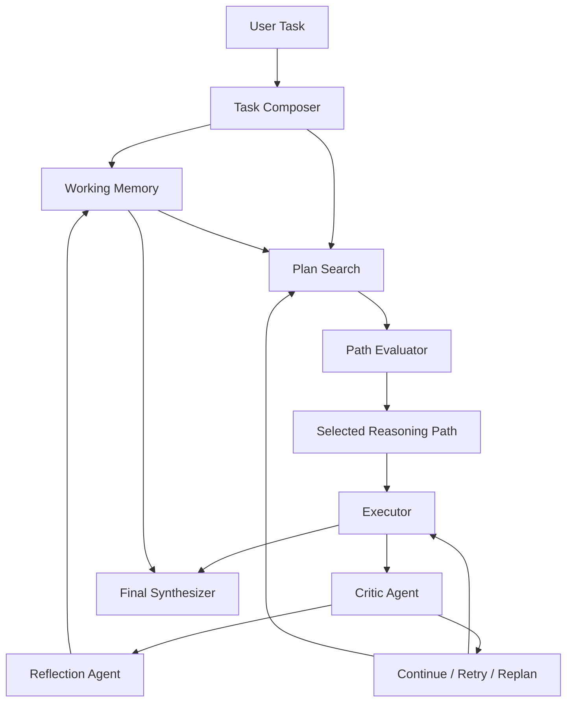

# Reflective Plan-and-Execute Agent

An LLM agent prototype for complex task solving with explicit planning,
working memory, self-correction, and search-based reasoning.

This project explores a reflective agent architecture that does more than
produce a single answer. It composes the user's request into a structured task,
searches over multiple candidate plans, executes the selected path, critiques
intermediate results, reflects on failures, updates working memory, and exports
traceable reasoning state for analysis.

## Why This Project Exists

Most simple agent demos follow a linear loop:

```text
prompt -> plan -> execute -> answer
```

That pattern is easy to build, but it hides the parts that matter for complex
work: plan quality, error recovery, memory use, and whether the agent can choose
between competing solution paths. This project makes those mechanisms explicit
and inspectable.

## Core Capabilities

- Task composition into goal, task type, constraints, success criteria, and assumptions.
- Multi-path plan search before execution.
- Candidate path scoring by goal alignment, feasibility, evidence potential, and risk.
- Plan-and-execute loop with structured `AgentState`.
- Critic agent for execution quality, goal alignment, and evidence strength.
- Reflection agent for lessons, failure modes, and correction strategies.
- Retry and replan control actions based on critic feedback.
- Explicit working memory for observations, decisions, failed attempts, and lessons.
- Full trace export for reasoning inspection.
- Trace analyzer for run-level diagnostics.
- Evaluation demo for comparing agent variants.
- Deterministic tests with a fake model client.

## Architecture



## Project Structure

```text
agent/
  __init__.py
  core.py
  memory.py
  models.py
  utils.py
analyze_trace.py
demo.py
eval_demo.py
plan_and_execute_agent.py
tests/
```

- `agent/core.py`: agent roles and orchestration loop.
- `agent/models.py`: task, plan, critique, reflection, path, and state models.
- `agent/memory.py`: working-memory data structures.
- `agent/utils.py`: normalization and timestamp helpers.
- `plan_and_execute_agent.py`: compatibility import entry point.
- `demo.py`: interactive product demo.
- `analyze_trace.py`: reasoning trace analyzer.
- `eval_demo.py`: lightweight evaluation harness for comparing variants.
- `tests/`: deterministic fake-client tests.

## Setup

```powershell
python -m venv .venv
.\.venv\Scripts\Activate.ps1
pip install -r requirements.txt
```

Set your OpenAI API key for live agent runs:

```powershell
$env:OPENAI_API_KEY="your-api-key"
```

The tests, trace analyzer, and sample evaluation demo do not require an API key.

## Run The Agent Demo

```powershell
python demo.py
```

Run a custom task and export the full reasoning trace:

```powershell
python demo.py --task "Compare LangGraph, CrewAI, and AutoGen for an internal knowledge-base agent." --trace-out runs/trace.json
```

The demo prints:

- Composed task type and goal.
- Candidate reasoning paths with scores.
- Selected path.
- Step-level critic quality.
- Working-memory counts.
- Final answer.

## Analyze A Trace

```powershell
python analyze_trace.py runs/trace.json
```

JSON output is also available:

```powershell
python analyze_trace.py runs/trace.json --json
```

The analyzer reports:

- Selected reasoning path and candidate path scores.
- Executed step count, retry count, and replan count.
- Average critic scores.
- Critic issues and reflection lessons.
- Working-memory usage.
- Whether a final answer was produced.

## Compare Agent Variants

Run the built-in sample evaluation:

```powershell
python eval_demo.py --use-samples
```

Compare saved traces:

```powershell
python eval_demo.py baseline=runs/baseline.json reflective=runs/reflective.json search_memory=runs/search_memory.json
```

The evaluation harness uses explicit `EvaluationCase`, `EvaluationMetric`, and
`EvaluationResult` structures. It is intentionally lightweight so the project
can later integrate OpenAI Evals, DeepEval, LangSmith, or another evaluation
framework without changing the trace format.

## Run Tests

```powershell
python -m unittest discover -s tests
```

The tests use a fake model client and cover:

- Highest-scoring candidate path selection.
- Critic-triggered retry behavior.
- Critic-triggered replanning.
- Trace analyzer summaries.
- Evaluation demo ranking and formatting.

## Example Evaluation Output

```text
Agent Variant Evaluation
========================

Variants compared: 3
Best variant: search_memory

Scores:
- search_memory: overall=0.926
  paths=3 steps=2 retries=1 replans=1
  memory_items=8 reflections=3 issues=1
- reflective: overall=0.736
  paths=1 steps=2 retries=1 replans=0
  memory_items=5 reflections=2 issues=1
- baseline: overall=0.484
  paths=1 steps=2 retries=0 replans=0
  memory_items=0 reflections=0 issues=1
```

## What This Demonstrates

This project demonstrates agent architecture concepts that are often hidden in
simple chatbot demos:

- How a task can be represented as structured state.
- How planning can be treated as a search problem.
- How critic and reflection roles can improve execution.
- How working memory can shape later reasoning steps.
- How agent behavior can be traced, analyzed, and evaluated.

## Roadmap

- Add an optional LLM-as-judge evaluator for final answer and trace quality.
- Add richer task suites for repeatable evaluation.
- Split agent roles into separate modules if the architecture grows further.
- Add saved sample traces under `examples/` for portfolio screenshots.
- Add integration adapters for external tools or web search.
